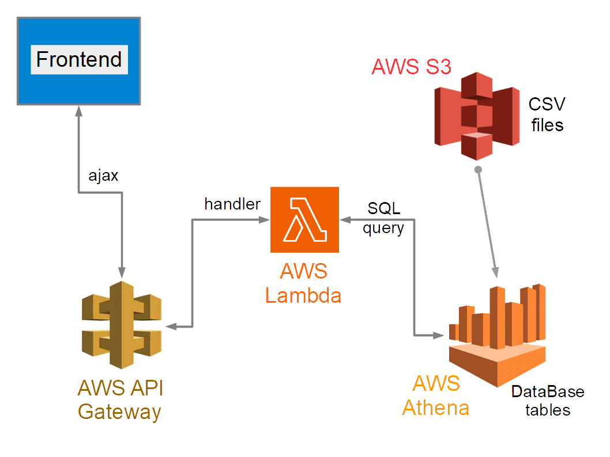

# Principle and architecture of webapp

The diagram below illustrates the architecture of the webapp.

 

User enters a street name in the front end input area. When the start button or the return key are pressed, the API Gateway is triggered so the user request is transferred to the Lambda function. The Lambda function is a python script, which sends an SQL query to Athena. The query's result is returned to Lambda. Lambda sends the result JSON back to the front end. The result of the user's query is shown on a map of France.

# Usage

## Front end

The front end has been developped with Bootstrap framework.

### URL of API Gateway

An API Gateway is created in AWS to trigger the Lambda function. The API Gateway URL given on AWS is then included in index.html 

### Map of France regions

The map is implemented through JS files, which may be downloaded from the documented site https://jvectormap.com/

## Back end

The back end has two main components: python scripts in Lambda and a database in Athena.

### Python scripts in Lambda

The python scripts in Lambda are submit_button_lambda_handler.py and constants.py 

### Database creation in AWS Athena

Athena's user guide is of great help to create the needed database. It can be found from https://docs.aws.amazon.com/athena/latest/ug/what-is.html

The database contains two tables, namely communes_departements_regions and france_rues.

communes_departements_regions directly constructed from communes-departement-region.csv, which can be downloaded from https://www.data.gouv.fr/en/datasets/communes-de-france-base-des-codes-postaux/

france_rues was constructed from full.csv.gz that can be dowmloaded from http://bano.openstreetmap.fr/data/. Useful information on the structure of this CSV can be found from https://www.data.gouv.fr/en/datasets/base-d-adresses-nationale-ouverte-bano/.

Note that full.csv is a large file of about 1.7 GB. france_rues is much shorter and thus yields much faster execution of SQL queries than with the full table.

france_rues was created from full through the following SQL query

```
SELECT voie,code_post,nom_comm
INTO france_rues
FROM full
GROUP BY voie,code_post,nom_comm
ORDER BY nom_comm;
```

### CSV files in S3

The CSV files mentioned above to construct the database are stored in S3.